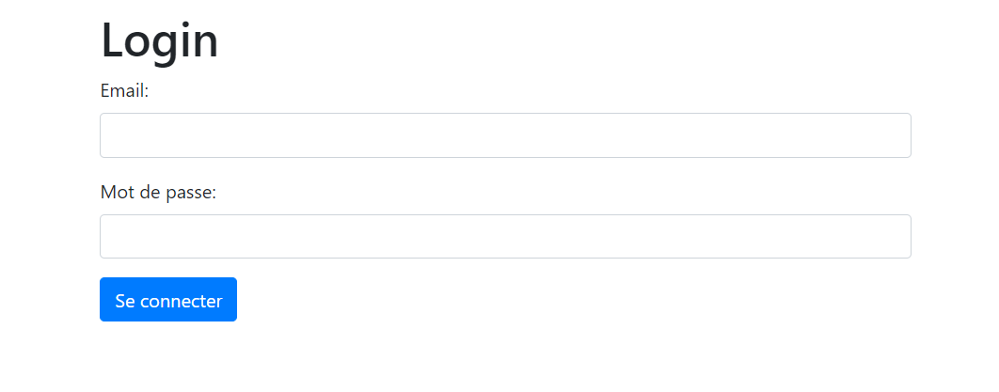
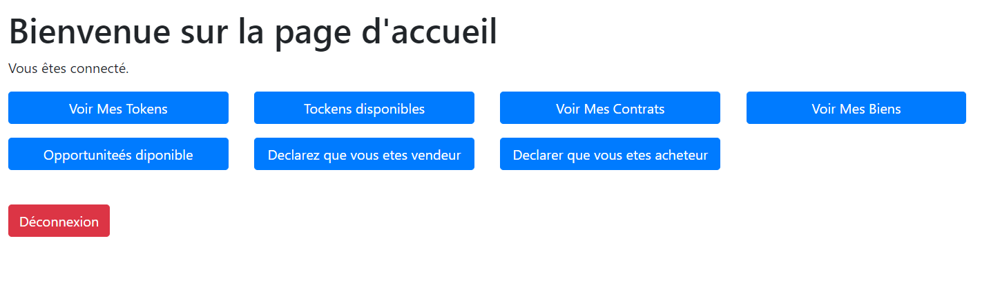
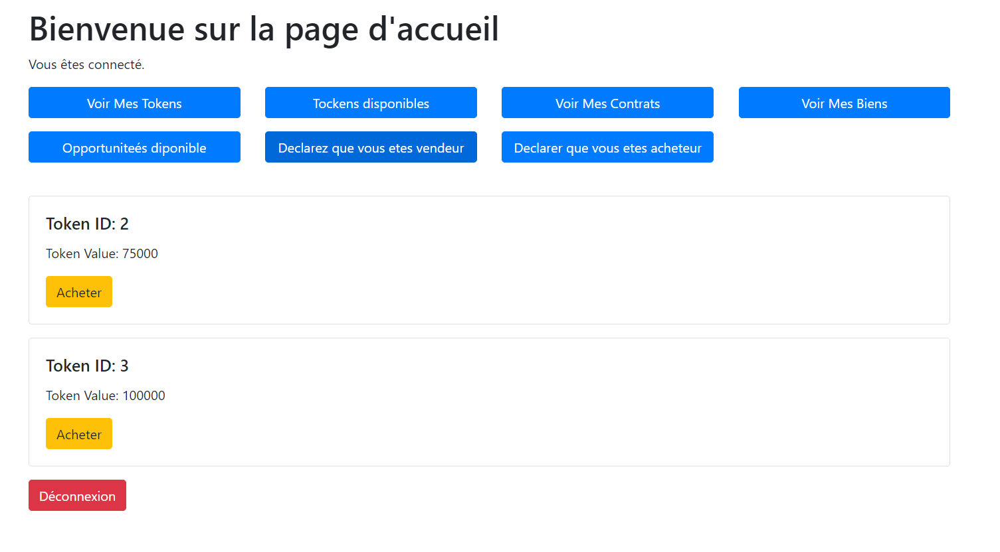

# Api Tirok

## Cahier des charges

- **Création des Smart Contracts :** Concevez la ou les routes API nécessaires pour créer des smart contracts pour la distribution des Tokens et le suivi de leurs détenteurs.
- **Achat de Tokens :** Mettez en œuvre une route API permettant à un utilisateur d'acheter des tokens.
- **Gestion des Loyers :** Créez la route API pour recevoir les loyers et redistribuer les gains aux détenteurs de tokens.
- **Marché Secondaire :** Facilitez la revente de tokens sur un marché secondaire.

## Les fonctionnalités réalisées

- Une simple authentification pour distinguer les utilisateurs.
- Possibilité d'acheter un bien.
- Possibilité de tokeniser un bien.
- Possibilité d'acheter des tokens.
- Simulation des smart contracts créés lors de l'achat des tokens.

## Scénario testable

1. Commencez par lancer le script d'initialisation de la base de données, création des tables et insertion des fixtures.

2. Dans cette base, il y a 3 utilisateurs :
   - utilisateur1@email.com, motdepasse1
   - utilisateur2@email.com, motdepasse2
   - utilisateur3@email.com, motdepasse3

3. Allez vers http://localhost:3000/ ; vous serez redirigé vers la page de connexion.

4. Vous pouvez choisir de vous connecter avec le compte utilisateur1@email.com, motdepasse1.

5. Une fois connecté, vous avez la possibilité de :
   1. Voir vos tokens.
   2. Voir les tokens disponibles (c'est-à-dire les tokens que vous pouvez acheter).
   3. Voir vos contrats.
   4. Voir vos biens.
   5. Voir les biens disponibles (c'est-à-dire les biens que vous pouvez acheter).

6. Vous pouvez cliquer sur "voir mes tokens" pour connaître le nombre actuel.

7. Ensuite, allez vers "mes biens" et cliquez sur "Vendre".

8. Revenez à vos tokens, et vous verrez que le bien a été divisé en 10 tokens (pour faciliter) et les tokens sont maintenant dans votre liste, un autre utilisateur peut les acheter.

9. Vous pouvez également tester l'achat d'un bien (marché primaire), c'est-à-dire que le bien lui-même sera dans votre liste.

10. Vous pouvez également acheter des tokens dans la liste des tokens disponibles (dans ce cas, uniquement des contrats fictifs seront créés en raison du manque de temps).

11. Il existe deux autres boutons qui ne sont pas très importants pour le moment. Je les ai implémentés pour la phase d'entraînement sur les outils techniques à utiliser. Ils permettent de savoir si l'utilisateur est un vendeur ou un acheteur.

## Remarque

Le vrai problème que j'ai eu concerne les concepts métiers, et je n'avais pas beaucoup de temps pour me documenter sur ce domaine vaste avant d'envoyer le test, mais l'expérience était valorisante et enrichissante pour moi.

Merci !
